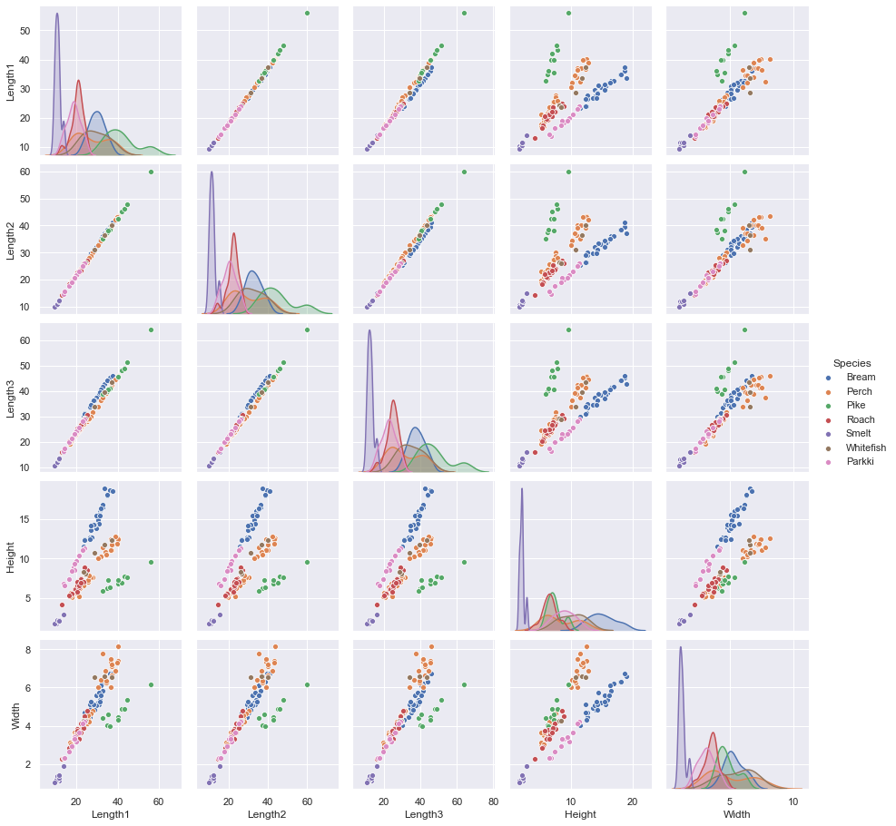

# <p style="text-align: center;">MIS 382N: ADVANCED PREDICTIVE MODELING - MSBA</p>
# <p style="text-align: center;">Assignment 1</p>
## <p style="text-align: center;">Total points: 85</p>
## <p style="text-align: center;">Due: Monday, September 14 submitted via Canvas by 11:59 pm</p>

Your homework should be written in a **Jupyter notebook**. You may work in groups of two if you wish. Your partner needs to be from the same section. Only one student per team needs to submit the assignment on Canvas.  But be sure to include name and UTEID for both students.  Homework groups will be created and managed through Canvas, so please do not arbitrarily change your homework group. If you do change, let the TA know. 

Also, please make sure your code runs and the graphics (and anything else) are displayed in your notebook before submitting. (%matplotlib inline)

## Authors

### Matthew Leong - mcl2994

### Chirag Ramesh - cr44748

## My Contribution:

I (Matthew) handled the theroretical questions this time around which were questions 1, 2, and 5. Chirag handled the code but also got help from me for the analysis. 

# Question 1: Challenges in Data Science (10 pts)

Refer to the Domino guide under Modules --> Additional Resources

Section 2 describes 8 Challenges. You may have personally encountered or heard of somebody else who encountered some of these challenge. If so, please write 1-2 paragraphs on what situation was encountered and how it mapped into one the mentioned challenges. If not, think of a hypothetical case and do the same exercise.

### Answer

We discussed it amongst ourselves and we decided to go with Matthew's tale for this answer.

I have personally encountered the challenge of solving the right problem but didn't realize it had already been solved. In fact, this challenge came up twice even all within one day. I encountered this challenge in doing a group project for data analytics programming. My group chose to try and predict how a university would be ranked using a dataset from a university ranking site. We quickly soon realized that we were trying to predict a predictor. In other words, we tried to predict university ranking when it was already solved and thus our work would make no sense.

We then shifted over to a loan dataset and we wanted to see if a loan would default or not. Again, we did not immediately realize that it had been solved. The crediting rating which was tied to interest rate was the main factor in which a loan would default and it was also a predictor. So due to this specific challenge, we had to abandon our work yet again until we found a dataset on diabetes in which we finally managed to avoid this issue. 

# Question 2: Guess the coin (5+5 = 10 points)

Assume we are playing a guessing game with a friend. The friend has three coins at hand:
* **Coin A**: a fair coin with equal probability of being head (H ) or tail (T)
* **Coin B**: a biased coin with a probability of 0.75 being head (H)
* **Coin C**: a coin with a probability of $P^*(H)$ being head (H)

The friend secretly picked one of the coins, randomly flipped it a few times, and get a sequence of *HTHHTT* (all of which come from the same coin he picked). 

1. If you had to choose between whether **Coin A** or **Coin B** was used, and you prefer the one which is more likely, which one will you choose?  (5 points)
2. What would be the value of  $P^*(H)$ such that **Coin C** corresponds to the most likely (among infinite possible coins) coin to have produced the observed sequence?(i.e. provide  an analytical derivation for $P^*(H)$ using maximum likelihood estimation (MLE))."

## Answer

### 1.

We would choose coin A between the two. The tosses are evenly split which is more likely to happen with coin A rather than coin B. For coin B, we would expect to see more heads rather than an even number of heads and tails.

### 2.

The probability distribution of a coin toss is binomial. This means that the distribution looks like:  
$P(x|n,p) = (\frac{n!}{x!(n-x)!})p^x(1-p)^{n-x}$  
Where x is the number of heads, n is the total amount of coin tosses, and p is the probability of a coin toss being heads. 

Let us modify the probability distribution in terms of likelihood.  
$L(p|n,x) = (\frac{n!}{x!(n-x)!})p^x(1-p)^{n-x}$  
Where x is the number of heads, n is the total amount of coin tosses, and p is the probability of a coin toss being heads. The key difference here is that we interpret this likelihood as given n total amount of coin tosses and x the number of heads, what is the likelihood that the probability is p? 

We then do a log transformation on the likelihood function to make taking the partial derivative with respect to p easier.   
$ln L(p|n,x) = ln(n!)+x*ln(p) - ln(x!(n-x)!) + (n-x)ln(1-p)$  
$\frac{\delta}{\delta_p} ln L(p|n,x) = \frac{\delta}{\delta_p} [ln(n!)+x*ln(p) - ln(x!(n-x)!) + (n-x)ln(1-p)]$  
$= \frac{x}{p} - \frac{n-x}{1-p}$  
We set this partial equal to zero to solve for the maximum probability.  
$ 0 = \frac{x}{p} - \frac{n-x}{1-p}$  
$ \frac{n-x}{1-p} = \frac{x}{p}$  
$ n-x = \frac{x}{p} - x$  
$ n = \frac{x}{p}$  
$ p = \frac{x}{n}$  

Thus, the Maximum Likelihood estimate is $\frac{x}{n} = \frac{3}{6} = 0.50 = P^*(H)$. This means that coin C must also be a fair coin like A.

#### Misc Old question answer

We didn't want this one to go to waste so we also included it here

## 1.

The probability distribution of a coin toss is binomial. This means that the distribution looks like:  
$P(x|n,p) = (\frac{n!}{x!(n-x)!})p^x(1-p)^{n-x}$  
Where x is the number of heads, n is the total amount of coin tosses, and p is the probability of a coin toss being heads. 

The maximum likelihood principle states that we want to pick the probability distribution or coin that has the higher chance of having this event occur. Given that he got 3 heads and 3 tails out of 6 coin tosses, we are inclined to go with our intuition of the coin being fair. Our intuition in this case matches with the maximum likelihood principle in that a fair coin would have a higher likelihood of this event occuring than the biased coin. In 2., we verify this by computing the respective likelihoods.

## 2.

Let us modify the probability distribution in terms of likelihood.  
$L(p|n,x) = (\frac{n!}{x!(n-x)!})p^x(1-p)^{n-x}$  
Where x is the number of heads, n is the total amount of coin tosses, and p is the probability of a coin toss being heads. The key difference here is that we interpret this likelihood as given n total amount of coin tosses and x the number of heads, what is the likelihood that the probability is p? 

First let's begin with the fair coin:

$L(0.5|6,3) = (\frac{6!}{3!(6-3)!})*(0.5)^3(1-0.5)^{6-3}$  
$L(0.5|6,3) = 20*(0.5)^6$   
$L(0.5|6,3) = 0.3125$  
As we can see, the likelihood that it is coin A is 31.25%.

Now let's compare that to coin B which is weighted:

$L(0.75|6,3) = (\frac{6!}{3!(6-3)!})*(0.75)^3(1-0.75)^{6-3}$  
$L(0.75|6,3) = 20*(0.75)^3(0.25)^3$  
$L(0.75|6,3) \approx 0.1318359375$  
As we can see the likelihood that these events come from coin b, the biased coin, is about 13.18% which is lower than coin A, the fair coin. Thus we have verified our intuition about the fair coin having the higher likelihood than coin B.

# Question 3: Multiple Linear Regression (30 pts)

This dataset is a record of 7 common different fish species in fish market sales. With this dataset, a predictive model can be developed using machine friendly data and the weight of fish can be predicted. Use the following code to import the Fish market prices dataset in python. The dataset is taken from https://www.kaggle.com/aungpyaeap/fish-market.


```python
from sklearn import linear_model
from sklearn.metrics import mean_absolute_error
import numpy as np
import pandas as pd
pd.options.mode.chained_assignment = None


df = pd.read_csv("data.csv", index_col=0)
df.head()
```


<div>
<style scoped>
    .dataframe tbody tr th:only-of-type {
        vertical-align: middle;
    }

    .dataframe tbody tr th {
        vertical-align: top;
    }

    .dataframe thead th {
        text-align: right;
    }
</style>
<table border="1" class="dataframe">
  <thead>
    <tr style="text-align: right;">
      <th></th>
      <th>Weight</th>
      <th>Length1</th>
      <th>Length2</th>
      <th>Length3</th>
      <th>Height</th>
      <th>Width</th>
    </tr>
    <tr>
      <th>Species</th>
      <th></th>
      <th></th>
      <th></th>
      <th></th>
      <th></th>
      <th></th>
    </tr>
  </thead>
  <tbody>
    <tr>
      <th>Bream</th>
      <td>242.0</td>
      <td>23.2</td>
      <td>25.4</td>
      <td>30.0</td>
      <td>11.5200</td>
      <td>4.0200</td>
    </tr>
    <tr>
      <th>Bream</th>
      <td>290.0</td>
      <td>24.0</td>
      <td>26.3</td>
      <td>31.2</td>
      <td>12.4800</td>
      <td>4.3056</td>
    </tr>
    <tr>
      <th>Bream</th>
      <td>340.0</td>
      <td>23.9</td>
      <td>26.5</td>
      <td>31.1</td>
      <td>12.3778</td>
      <td>4.6961</td>
    </tr>
    <tr>
      <th>Bream</th>
      <td>363.0</td>
      <td>26.3</td>
      <td>29.0</td>
      <td>33.5</td>
      <td>12.7300</td>
      <td>4.4555</td>
    </tr>
    <tr>
      <th>Bream</th>
      <td>430.0</td>
      <td>26.5</td>
      <td>29.0</td>
      <td>34.0</td>
      <td>12.4440</td>
      <td>5.1340</td>
    </tr>
  </tbody>
</table>
</div>


Here,
1. Species: Species name of fish
2. Weight: Weight of fish in gram
3. Length1: Vertical length in cm
4. Length2: Diagonal length in cm
5. Length3: Cross length in cm
6. Height: Height in cm
7. Width: Diagonal width in cm


```python
df = df.fillna(0)
X = df.drop(['Weight'], axis=1)
y = df['Weight']
```

Consider the `Weight` column to be your target variable.

a. (2 pts)  Print the shape (number of rows and columns) of the feature matrix X, and print the first 5 rows.

b. (6 pts) Using ordinary least squares, fit a multiple linear regression (MLR) on all the feature variables using the entire dataset. Report the regression coefficient of each input feature and evaluate the model using mean absolute error (MAE). Example of ordinary least squares in Python is shown in Section 1.1.1 of http://scikit-learn.org/stable/modules/linear_model.html.

c. (6 pts) Split the data into a training set and a test set, using the train_test_split with test_size = 0.25 and random_state = 50. Fit an MLR using the training set. Evaluate the trained model using the training set and the test set, respectively. Compare the two MAE values thus obtained. Report the [$R^2$ (coefficient of determination)](https://scikit-learn.org/stable/modules/generated/sklearn.metrics.r2_score.html) value.

d. (5 pts) Calculate the pearson correlation matrix of the independent variables in the training set. Report the variables which have magnitude of correlation greater than 0.8 w.r.t the variable 'Length2'. Now, plot a pairplot based on Species column as seen in the 2nd plot [here](https://seaborn.pydata.org/generated/seaborn.pairplot.html). How does the pairplot validate your previous answer?

e. (6 pts) Plot the histogram of Y_train and see its distribution. Now take log of Y_train and plot its histogram. Now run regression again after taking log and compare the MAE. You need to do np.exp(predictions) to bring them back to original scale, and then calculate MAE and $R^2$. Explain the results.

f. (5 pts) Rank the features in descending order based on their significance. You might find this link to be helpful: http://scikit-learn.org/stable/modules/generated/sklearn.feature_selection.RFE.html.

g. (Bonus question - 5 pts) Use the Species column for one-hot encoding and perform part c of this question. Explain your results.

## Answer

#### a.


```python
# prints the number of rows and columns (159 rows and 5 columns)
X.shape 
```


    (159, 5)


```python
#prints first 5 rows of the dataframe
X.head(5) 
```


<div>
<style scoped>
    .dataframe tbody tr th:only-of-type {
        vertical-align: middle;
    }

    .dataframe tbody tr th {
        vertical-align: top;
    }

    .dataframe thead th {
        text-align: right;
    }
</style>
<table border="1" class="dataframe">
  <thead>
    <tr style="text-align: right;">
      <th></th>
      <th>Length1</th>
      <th>Length2</th>
      <th>Length3</th>
      <th>Height</th>
      <th>Width</th>
    </tr>
    <tr>
      <th>Species</th>
      <th></th>
      <th></th>
      <th></th>
      <th></th>
      <th></th>
    </tr>
  </thead>
  <tbody>
    <tr>
      <th>Bream</th>
      <td>23.2</td>
      <td>25.4</td>
      <td>30.0</td>
      <td>11.5200</td>
      <td>4.0200</td>
    </tr>
    <tr>
      <th>Bream</th>
      <td>24.0</td>
      <td>26.3</td>
      <td>31.2</td>
      <td>12.4800</td>
      <td>4.3056</td>
    </tr>
    <tr>
      <th>Bream</th>
      <td>23.9</td>
      <td>26.5</td>
      <td>31.1</td>
      <td>12.3778</td>
      <td>4.6961</td>
    </tr>
    <tr>
      <th>Bream</th>
      <td>26.3</td>
      <td>29.0</td>
      <td>33.5</td>
      <td>12.7300</td>
      <td>4.4555</td>
    </tr>
    <tr>
      <th>Bream</th>
      <td>26.5</td>
      <td>29.0</td>
      <td>34.0</td>
      <td>12.4440</td>
      <td>5.1340</td>
    </tr>
  </tbody>
</table>
</div>


#### b.


```python
from sklearn.metrics import mean_squared_error 

#Multiple linear Regression model
mlr = linear_model.LinearRegression()
mlr.fit(X, y)
y_pred = mlr.predict(X)
MAE = np.mean(np.abs(y-y_pred))

print('Coefficients: \n', mlr.coef_)
print('MAE: ', MAE)
```

    Coefficients: 
     [ 62.35521443  -6.52675249 -29.02621861  28.29735132  22.47330665]
    MAE:  91.78724088307949
    

#### c.


```python
from sklearn.model_selection import train_test_split
from sklearn.metrics import r2_score
```


```python
from sklearn.model_selection import train_test_split
from sklearn.metrics import r2_score

X_train, X_test, y_train, y_test = train_test_split(X, y, test_size=0.25, random_state=50)

mlr = linear_model.LinearRegression()
mlr.fit(X_train, y_train)

train_pred = mlr.predict(X_train)
test_pred = mlr.predict(X_test)

train_MAE = np.mean(np.abs(y_train-train_pred))
test_MAE = np.mean(np.abs(y_test-test_pred))

train_R2 = r2_score(y_train, train_pred)
test_R2 = r2_score(y_test, test_pred)

print('Train R2:', train_R2)
print('Test R2:', test_R2)

print('Train MAE:', train_MAE)
print('Test MAE:', test_MAE)
```

    Train R2: 0.878916337517605
    Test R2: 0.8919608385022907
    Train MAE: 84.82479753198542
    Test MAE: 101.89481945056991
    

Comparing the two MAE, we can see that the model performs better on the training data than the test data because the train MAE is lower. On the other hand the test data has a higher $R^2$ implying that more variation is explained there than in the training.

d.


```python
import seaborn as sns

corr_matrix = X_train.corr()
print(corr_matrix[corr_matrix['Length2'] > 0.8][['Length2']])

sns.set(style="darkgrid")

Xplot = X_train.reset_index()
pairwise = sns.pairplot(Xplot, hue='Species')
```

              Length2
    Length1  0.999399
    Length2  1.000000
    Length3  0.992702
    Width    0.853645
    


    

    


From the pearson correlation matrix, we would expect to see Length1, Length3, and Wdith to have a relationship that looks like a positive linear line. This is certainly true for length1 and length3 which is to be expected considering the correlation value is really close to 1. Width also demonstrates this property but a bit less so since its correlation value with respect to length2 is about 0.85. Lastly, we expected height to be somewhat uncorrelated which is shown in the pairplot.

e.


```python
# Histogram
y_train.plot(kind = 'hist',title = 'Linear of Y_train')

# Regression
mlr = linear_model.LinearRegression()
mlr.fit(X_train, y_train)
trainpred = mlr.predict(X_train)
MAE = np.mean(np.abs(y_train-train_pred))
R2 = r2_score(y_train, train_pred)

# Log_histogram
ylog = pd.DataFrame(np.log(y_train))
ylog.plot(kind = 'hist', title = 'Log of Y_train')

# Log_regression
mlr.fit(X_train, ylog)
log_pred = mlr.predict(X_train)
log_pred = pd.Series(log_pred.tolist()).map(lambda x: x[0])
yunlog = np.exp(log_pred)
diff = pd.Series(list(y_train)) - pd.Series(list(yunlog)) # weird
unlogMAE = np.mean(np.abs(diff))
log_R2 = r2_score(y_train, yunlog)

print('Regular R2:', R2)
print('Log R2:', log_R2)
print('Log MAE:', unlogMAE)
print('Regular MAE:', MAE)
```

    Regular R2: 0.878916337517605
    Log R2: 0.7042361514462878
    Log MAE: 95.25208926559337
    Regular MAE: 84.82479753198542
    


    

    


    

    


We found that a linear model is better than the log model. This can be seen with the lower MAE and higher $R^2$ in the linear model as opposed to the log model. The results imply that the relationship is linear rather than logarithmic.

f.


```python
from sklearn.feature_selection import RFE

mlr = linear_model.LinearRegression()
selector = RFE(mlr)
selector = selector.fit(X_train, y_train)

# Ranking
corr_matrix['ranking'] = selector.ranking_
rank = corr_matrix[['ranking']].sort_values(by='ranking',ascending=False)
rank
```


<div>
<style scoped>
    .dataframe tbody tr th:only-of-type {
        vertical-align: middle;
    }

    .dataframe tbody tr th {
        vertical-align: top;
    }

    .dataframe thead th {
        text-align: right;
    }
</style>
<table border="1" class="dataframe">
  <thead>
    <tr style="text-align: right;">
      <th></th>
      <th>ranking</th>
    </tr>
  </thead>
  <tbody>
    <tr>
      <th>Length2</th>
      <td>4</td>
    </tr>
    <tr>
      <th>Length3</th>
      <td>3</td>
    </tr>
    <tr>
      <th>Height</th>
      <td>2</td>
    </tr>
    <tr>
      <th>Length1</th>
      <td>1</td>
    </tr>
    <tr>
      <th>Width</th>
      <td>1</td>
    </tr>
  </tbody>
</table>
</div>


g. (Bonus question - 5 pts) Use the Species column for one-hot encoding and perform part c of this question. Explain your results.

While we aren't doing the bonus question due to time opportunity cost, we do have a plan to tackle this question that we would like to touch on. For this problem, we would create 6 dummy variables out of the 7 species. We only need 6 because the seventh would be redundant in the interpretation. After creating the dummy variables, we would then run the code in part c and explain the results.

# Question 4 (30 pts)

Using the same data from the previous question, in this question you will explore the application of Lasso and Ridge regression using sklearn package in Python. Use the same train and test data with additional augmented columns from before. Scale the data so that each of the independent variables have zero mean and unit variance. You can use the [sklearn.preprocessing.scale](https://scikit-learn.org/stable/modules/generated/sklearn.preprocessing.scale.html) function for this.


```python
from sklearn.linear_model import LinearRegression, Lasso, Ridge, RidgeCV, LassoCV
```

1) Use sklearn.linear_model.Lasso and sklearn.linear_model.Ridge classes to do a [5-fold cross validation](http://scikit-learn.org/stable/auto_examples/exercises/plot_cv_diabetes.html#example-exercises-plot-cv-diabetes-py) using sklearn's [KFold](http://scikit-learn.org/stable/modules/generated/sklearn.cross_validation.KFold.html). For the sweep of the regularization parameter, we will look at a grid of values ranging from $\lambda = 10^{10}$ to $\lambda = 10^{-2}$. In Python, you can consider this range of values as follows:

      import numpy as np

      alphas =  10**np.linspace(10,-2,100)*0.5

  Report the best chosen $\lambda$ based on cross validation. The cross validation should happen on your training data using  average MAE as the scoring metric. (8pts)

2) Run ridge and lasso for all of the alphas specified above (on training data), and plot the coefficients learned for each of them - there should be one plot each for lasso and ridge, so a total of two plots; the plots for different features for a method should be on the same plot. What do you qualitatively observe when value of the regularization parameter is changed? (7pts)

3) Run least squares regression, ridge, and lasso on the training data. For ridge and lasso, use only the best regularization parameter. Report the prediction error (MAE) on the test data for each. (5pts)

4) Run lasso again with cross validation using [sklearn.linear_model.LassoCV](http://scikit-learn.org/stable/modules/generated/sklearn.linear_model.LassoCV.html). Set the cross validation parameters as follows:

    LassoCV(alphas=None, cv=10, max_iter=10000)

Report the best $\lambda$ based on cross validation. Run lasso on the training data using the best $\lambda$ and report the coefficeints for all variables. (5pts)

5) Why did we have to scale the data before regularization? (5pts)

## Answer

#### 1.


```python
from sklearn.preprocessing import StandardScaler

# scale X
X = pd.DataFrame(StandardScaler().fit_transform(X))
```


```python
import numpy as np
from sklearn.model_selection import KFold

# setup model
kf = KFold(5)
alphas = 10**np.linspace(10,-2,100)*0.5
lasso_MAE = []
ridge_MAE = []

# run grid search
for alpha in alphas:
    lMAE = []
    rMAE = []

    for train_index, test_index in kf.split(X):
        
        # get current KFold sets
        X_train, X_test = X.iloc[train_index], X.iloc[test_index]
        y_train, y_test = y.iloc[train_index], y.iloc[test_index]
        
        # lasso run
        lasso = Lasso(alpha=alpha, random_state=0, max_iter=100000)
        lasso.fit(X_train, y_train)
        y_pred = lasso.predict(X_test)
        llMAE = np.mean(np.abs(y_test-y_pred))
        lMAE = lMAE + [llMAE]
        
        # ridge run
        ridge = Ridge(alpha=alpha, random_state=0, max_iter=100000)
        ridge.fit(X_train, y_train)
        y_pred = ridge.predict(X_test)
        rrMAE = np.mean(np.abs(y_test-y_pred))
        rMAE = rMAE + [rrMAE]
        
    # capture scores
    lasso_MAE = lasso_MAE + [np.mean(lMAE)]
    ridge_MAE = ridge_MAE + [np.mean(rMAE)]

# build results table
lassoResults = pd.DataFrame()
lassoResults['Alpha'] = alphas.tolist()
lassoResults['MAE'] = lasso_MAE
ridgeResults = lassoResults.copy()
ridgeResults['MAE'] = ridge_MAE

# output best alphas
lmin = lassoResults['MAE'].idxmin()
rmin = ridgeResults['MAE'].idxmin()
results = pd.DataFrame()
results['Alpha'] = [lassoResults.iloc[lmin,0], ridgeResults.iloc[rmin,0]]
results['MAE'] = [lassoResults.iloc[lmin,1], ridgeResults.iloc[rmin,1]]
results.rename(index={0:'Lasso',1:'Ridge'},inplace=True)
print('Best Regression Alphas')
results
```

    Best Regression Alphas
    


<div>
<style scoped>
    .dataframe tbody tr th:only-of-type {
        vertical-align: middle;
    }

    .dataframe tbody tr th {
        vertical-align: top;
    }

    .dataframe thead th {
        text-align: right;
    }
</style>
<table border="1" class="dataframe">
  <thead>
    <tr style="text-align: right;">
      <th></th>
      <th>Alpha</th>
      <th>MAE</th>
    </tr>
  </thead>
  <tbody>
    <tr>
      <th>Lasso</th>
      <td>0.142402</td>
      <td>105.835381</td>
    </tr>
    <tr>
      <th>Ridge</th>
      <td>21.643806</td>
      <td>106.073945</td>
    </tr>
  </tbody>
</table>
</div>


#### 2.


```python
# rest test, train data
X_train, X_test, y_train, y_test = train_test_split(X, y, test_size=0.25, random_state=50)

# get coef
lcoef = []
rcoef = []
for alpha in alphas:
    
    # lasso run
    lasso = Lasso(alpha=alpha, random_state=0, max_iter=100000)
    lasso.fit(X_train, y_train)
    lcoef = lcoef + [lasso.coef_.tolist()]
        
    # ridge run
    ridge = Ridge(alpha=alpha, random_state=0, max_iter=100000)
    ridge.fit(X_train, y_train)
    rcoef = rcoef + [ridge.coef_.tolist()]
    
lassoResults['Coef'] = lcoef
ridgeResults['Coef'] = rcoef
```


```python
import matplotlib.pyplot as plt

fig, (ax1, ax2) = plt.subplots(2, 1)
fig.suptitle('Regression Coefs Across Alphas')

ax1.plot(np.log(alphas), lcoef, '.-')
ax1.set_ylabel('Lasso Coef')

ax2.plot(np.log(alphas), rcoef, '.-')
ax2.set_xlabel('Log Alpha')
ax2.set_ylabel('Ridge Coef')

plt.show()
```


    

    


We put things in logarithmic scale due to the range of alphas. Looking tat the log plot, we can see that increasing the regularization parameter causes coefficients to become smaller. 

#### 3.


```python
# setup
# best lambda found in 1.
score = []
lbalpha = results.iloc[0,0]
rbalpha = results.iloc[1,0]

# regression runs
least = LinearRegression()
lasso = Lasso(alpha=lbalpha, random_state=0, max_iter=100000)
ridge = Ridge(alpha=rbalpha, random_state=0, max_iter=100000)

# fits
least.fit(X_train, y_train)
lasso.fit(X_train, y_train)
ridge.fit(X_train, y_train)

# predictions
oy_pred = least.predict(X_test)
ly_pred = lasso.predict(X_test)
ry_pred = ridge.predict(X_test)

# scores
score = score + [np.mean(np.abs(y_test-oy_pred))]
score = score + [np.mean(np.abs(y_test-ly_pred))]
score = score + [np.mean(np.abs(y_test-ry_pred))]

# output
print('Regression Results')
print('Least: ', score[0])
print('Lasso: ', score[1])
print('Ridge: ', score[2])
```

    Regression Results
    Least:  101.89481945056995
    Lasso:  102.35325305680061
    Ridge:  103.55609350120119
    

#### 4.


```python
# find best alpha
lasso_cv = LassoCV(alphas=None, cv=10, max_iter=10000)
k_fold = KFold(5)
alphas4 = []
scores4 = []

for k, (train, test) in enumerate(k_fold.split(X, y)):
    lasso_cv.fit(X.iloc[train], y.iloc[train])
    alphas4 = alphas4 + [lasso_cv.alpha_]
    scores4 = scores4 +[lasso_cv.score(X.iloc[test], y.iloc[test])]
    
# report best alhpa
best = pd.DataFrame()
best['Alphas'] = alphas4
best['Score'] = scores4
bestidx = best['Score'].idxmin()
print(best.iloc[[bestidx]].rename(index={2:'Best'}))

# run on best alpha
lasso = Lasso(alpha=best.iloc[bestidx,0], random_state=0, max_iter=100000)
lasso.fit(X_train, y_train)

# report coef
coefTable = rank.copy()
coefTable['ranking'] = lasso.coef_.tolist()
coefTable.rename(columns={'ranking':'Coef'}, inplace=True)
print(coefTable)
```

            Alphas     Score
    Best  1.196811 -0.376958
                   Coef
    Length2  217.231303
    Length3    0.000000
    Height     0.000000
    Length1   62.218994
    Width     88.092585
    

#### 5.

We need to scale the data first because the models are greatly influnced by outliers. We also want to rescale the features of different magnitudes to get the same scaling.

# Question 5 (5 pts)

Lasso and ridge regularization techniques are often used to combat overfitting during linear regression. Which of the two yields more sparse models (i.e. fewer number of parameters) when the tuning parameter $\lambda$ is sufficiently large (but not infinite)?

## Answer

Lasso regression yields a more sparse model since it can zero out the coefficients while ridge regression can't. Ridge regression on the other hand sets the coefficients close to zero but not exactly zero.
