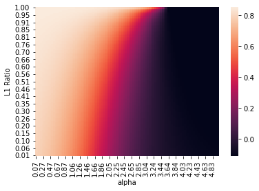
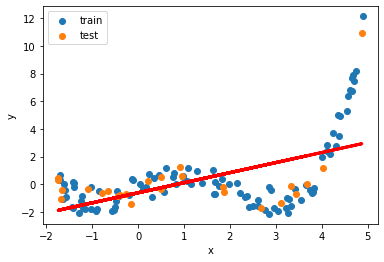
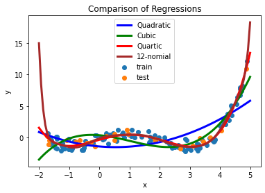
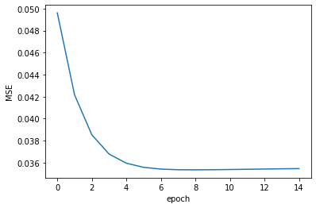
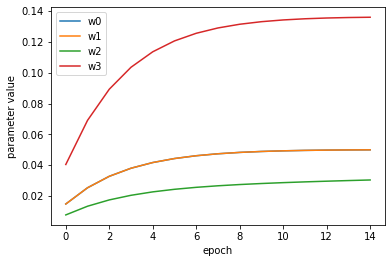

# <p style="text-align: center;">MIS 382N: ADVANCED PREDICTIVE MODELING - MSBA</p>
# <p style="text-align: center;">Assignment 2</p>
## <p style="text-align: center;">Total points: 80 </p>
## <p style="text-align: center;">Due: September 30, submitted via Canvas by 11:59 pm</p>

Your homework should be written in a **Jupyter notebook**. You may work in groups of two if you wish. Your partner needs to be from the same section. Only one student per team needs to submit the assignment on Canvas.  But be sure to include name and UTEID for both students.  Homework groups will be created and managed through Canvas, so please do not arbitrarily change your homework group. If you do change, let the TA know. 

Also, please make sure your code runs and the graphics (and anything else) are displayed in your notebook before submitting. (%matplotlib inline)

### Name(s)
#### 1. Chirag Ramesh
#### 2. Matthew Leong

## My Contribution:

I handled problem 3 regarding nonlinear regression models and also problem 4 regarding implementing a stochastic gradient descent method on a nonlinear model based on a class shell. Additionally, I found errors on the Teacher Assistant's provided class code and promptly fixed them.  
  
Chirag handled the code and part of the analysis for problems 1 and 2. 

# Question 1 (Understanding ElasticNet, 30 points)
Although lots of past studies have been conducted on factors affecting life expectancy using demographic variables, income composition and mortality rates, it was found that the effect of immunization and human development index was not taken into account. Hence, this motivates us to resolve this factor by formulating a regression model based on mixed effects model and multiple linear regression while considering data from 2014 for all countries. Here, important immunization like Hepatitis B, Polio and Diphtheria will also be considered. 

This dataset was taken from https://www.kaggle.com/kumarajarshi/life-expectancy-who.

**Please use Python 3.6+ for this assignment.**

First, we import packages and clean up the obtained dataset. We consider the `Life Expectancy` variable as the dependant variable whereas others are assumed to be independent variables.


```python
import pandas as pd
import numpy as np
import matplotlib.pyplot as plt
from tqdm import tqdm
import seaborn as sns
from sklearn.preprocessing import LabelEncoder
from sklearn.model_selection import train_test_split
from sklearn.linear_model import LinearRegression
import warnings
warnings.filterwarnings('ignore')
```


```python
df = pd.read_csv("life.csv", index_col=0)
print(df.shape)
df = df.loc[df['Year']==2014, :]
df = df.drop('Year', axis=1)
df = pd.get_dummies(df, columns=['Status'])
df = df.dropna()
print(df.shape)
```

    (2938, 21)
    (131, 21)
    


```python
df.head()
```


<div>
<style scoped>
    .dataframe tbody tr th:only-of-type {
        vertical-align: middle;
    }

    .dataframe tbody tr th {
        vertical-align: top;
    }

    .dataframe thead th {
        text-align: right;
    }
</style>
<table border="1" class="dataframe">
  <thead>
    <tr style="text-align: right;">
      <th></th>
      <th>Life expectancy</th>
      <th>Adult Mortality</th>
      <th>infant deaths</th>
      <th>Alcohol</th>
      <th>percentage expenditure</th>
      <th>Hepatitis B</th>
      <th>Measles</th>
      <th>BMI</th>
      <th>under-five deaths</th>
      <th>Polio</th>
      <th>...</th>
      <th>Diphtheria</th>
      <th>HIV/AIDS</th>
      <th>GDP</th>
      <th>Population</th>
      <th>thinness  1-19 years</th>
      <th>thinness 5-9 years</th>
      <th>Income composition of resources</th>
      <th>Schooling</th>
      <th>Status_Developed</th>
      <th>Status_Developing</th>
    </tr>
    <tr>
      <th>Country</th>
      <th></th>
      <th></th>
      <th></th>
      <th></th>
      <th></th>
      <th></th>
      <th></th>
      <th></th>
      <th></th>
      <th></th>
      <th></th>
      <th></th>
      <th></th>
      <th></th>
      <th></th>
      <th></th>
      <th></th>
      <th></th>
      <th></th>
      <th></th>
      <th></th>
    </tr>
  </thead>
  <tbody>
    <tr>
      <th>Afghanistan</th>
      <td>59.9</td>
      <td>271.0</td>
      <td>64</td>
      <td>0.01</td>
      <td>73.523582</td>
      <td>62.0</td>
      <td>492</td>
      <td>18.6</td>
      <td>86</td>
      <td>58.0</td>
      <td>...</td>
      <td>62.0</td>
      <td>0.1</td>
      <td>612.696514</td>
      <td>327582.0</td>
      <td>17.5</td>
      <td>17.5</td>
      <td>0.476</td>
      <td>10.0</td>
      <td>0</td>
      <td>1</td>
    </tr>
    <tr>
      <th>Albania</th>
      <td>77.5</td>
      <td>8.0</td>
      <td>0</td>
      <td>4.51</td>
      <td>428.749067</td>
      <td>98.0</td>
      <td>0</td>
      <td>57.2</td>
      <td>1</td>
      <td>98.0</td>
      <td>...</td>
      <td>98.0</td>
      <td>0.1</td>
      <td>4575.763787</td>
      <td>288914.0</td>
      <td>1.2</td>
      <td>1.3</td>
      <td>0.761</td>
      <td>14.2</td>
      <td>0</td>
      <td>1</td>
    </tr>
    <tr>
      <th>Algeria</th>
      <td>75.4</td>
      <td>11.0</td>
      <td>21</td>
      <td>0.01</td>
      <td>54.237318</td>
      <td>95.0</td>
      <td>0</td>
      <td>58.4</td>
      <td>24</td>
      <td>95.0</td>
      <td>...</td>
      <td>95.0</td>
      <td>0.1</td>
      <td>547.851700</td>
      <td>39113313.0</td>
      <td>6.0</td>
      <td>5.8</td>
      <td>0.741</td>
      <td>14.4</td>
      <td>0</td>
      <td>1</td>
    </tr>
    <tr>
      <th>Angola</th>
      <td>51.7</td>
      <td>348.0</td>
      <td>67</td>
      <td>8.33</td>
      <td>23.965612</td>
      <td>64.0</td>
      <td>11699</td>
      <td>22.7</td>
      <td>101</td>
      <td>68.0</td>
      <td>...</td>
      <td>64.0</td>
      <td>2.0</td>
      <td>479.312240</td>
      <td>2692466.0</td>
      <td>8.5</td>
      <td>8.3</td>
      <td>0.527</td>
      <td>11.4</td>
      <td>0</td>
      <td>1</td>
    </tr>
    <tr>
      <th>Argentina</th>
      <td>76.2</td>
      <td>118.0</td>
      <td>8</td>
      <td>7.93</td>
      <td>847.371746</td>
      <td>94.0</td>
      <td>1</td>
      <td>62.2</td>
      <td>9</td>
      <td>92.0</td>
      <td>...</td>
      <td>94.0</td>
      <td>0.1</td>
      <td>12245.256450</td>
      <td>42981515.0</td>
      <td>1.0</td>
      <td>0.9</td>
      <td>0.825</td>
      <td>17.3</td>
      <td>0</td>
      <td>1</td>
    </tr>
  </tbody>
</table>
<p>5 rows × 21 columns</p>
</div>


```python
# Creating training and testing dataset
y = df.iloc[:, 0]
X = df.iloc[:, 1:]

X_train, X_test, y_train, y_test = train_test_split(X, y, test_size=0.20, random_state = 42)
```

## Question 1.1 (5 points) 
Run Linear regression on the train dataset and print the $R^2$ values measured on (a) the training dataset and (b) the test dataset.

## Answer 1.1


```python
from sklearn import linear_model
from sklearn.metrics import r2_score

mlr = linear_model.LinearRegression()
mlr.fit(X_train, y_train)

train_pred = mlr.predict(X_train)
test_pred = mlr.predict(X_test)
train_R2 = r2_score(y_train, train_pred)
test_R2 = r2_score(y_test, test_pred)

print('Train R2:', train_R2)
print('Test R2:', test_R2)
```

    Train R2: 0.8869822224758938
    Test R2: 0.8355055233744485
    

## Question 1.2 (8 points) 
Run linear regression using Lasso and determine the value of $\alpha$ that results in best test set performance. Consider `alphas=10**np.linspace(1,-2,100)*0.5`. Display the best value of $\alpha$ as well as the corresponsing $R^2$ score on test set. Use the following parameters in Lasso model. Finally, store the best model separately. Also, use the co-efficients obtained and select the [columns with non-zero weights](https://stackoverflow.com/questions/62323713/selecting-columns-of-dataframe-where-lasso-coefficient-is-nonzero) and use them to create `X_train_lasso` and `X_test_lasso`. Show how many non-zero columns are present.

    copy_X=True
    normalize=True # Normalizes data using StandardScaler()
    random_state=42

## Answer 1.2


```python
from sklearn.preprocessing import StandardScaler
alphas=10**np.linspace(1,-2,100)*0.5 
scaler = StandardScaler()

train_scalex = scaler.fit_transform(X_train)
test_scalex = scaler.fit_transform(X_test)
lasso_regression = linear_model.LassoCV(alphas=alphas, normalize=True, copy_X=True, random_state=42) 
lasso_model = lasso_regression.fit(train_scalex, y_train)
lasso_pred_y = lasso_model.predict(test_scalex)
test_R2lasso = r2_score(y_test, lasso_pred_y)

print('The best alpha value is: ',lasso_model.alpha_)
print('Lasso R2 is: ',test_R2lasso)
```

    The best alpha value is:  0.046630167344161
    Lasso R2 is:  0.7326606923177986
    


```python
X_train_lasso = X_train.iloc[:,lasso_model.coef_ !=0]
X_test_lasso = X_test.iloc[:,lasso_model.coef_ !=0]
print(len(X_train_lasso.columns))
print(len(X_test_lasso.columns))
X_test_lasso.columns
```

    6
    6
    


    Index(['Adult Mortality', 'Total expenditure', ' HIV/AIDS',
           'Income composition of resources', 'Status_Developed',
           'Status_Developing'],
          dtype='object')


## Question 1.3 (6 points) 
Run linear regression using Ridge and determine the value of $\alpha$ that results in best test set performance. Consider `alphas=10**np.linspace(1,-2,100)*0.5`. Display the best value of $\alpha$ as well as the corresponsing $R^2$ score on test set. Use the following parameters in Ridge model.

    copy_X=True
    normalize=True # Normalizes data using StandardScaler()
    random_state=42

## Answer 1.3


```python
from sklearn.linear_model import RidgeCV

ridge_regression = linear_model.RidgeCV(alphas=alphas, normalize=True)
ridge_model = ridge_regression.fit(train_scalex, y_train)
ridge_pred_y = ridge_model.predict(test_scalex)
test_R2ridge = r2_score(y_test, ridge_pred_y)

print('The best alpha value using ridge: ',ridge_model.alpha_)
print('Ridge R2 is: ',test_R2ridge)
```

    The best alpha value using ridge:  0.0936908711430192
    Ridge R2 is:  0.6835243673854249
    

## Question 1.4  (8 points) 
Run [ElasticNet](https://scikit-learn.org/stable/modules/generated/sklearn.linear_model.ElasticNet.html) [(Video Reference)](https://youtu.be/1dKRdX9bfIo) on the `X_train_lasso` dataset by using all possible values from the below mentioned parameter set:

    l1_ratios = np.arange(0, 1.01, 0.01)  # 101 elements
    alphas = 10**np.linspace(1, -2, 100)*0.5 # 100 elements
    normalize = True
    random_state = 42


Store the $R^2$ score obtained from `X_test_lasso` set for each combination in an array with 101 rows and 100 columns. e.g.

    arr[i][j] = curr_r2_score # obtained using l1_ratios[i] and alphas[j]

where `i` is the `ith` element from `l1_ratio` and `j` is the `jth` element from `alphas`. Print the best $R^2$ score obtained using test set and its corresponding `alpha` and `l1 ratio`.


```python
arr = np.zeros((101, 100)) # Create 101x100 array
```

Note that by varying the `l1_ratio`, you are controlling the ratio of Lasso and Ridge regularization that is present in the model. When `l1_ratio = 1`, it means that the model uses Lasso regularization only whereas when `l1_ratio = 0`, it means that the model uses Ridge regularization only. You can find the formula for the loss function [here](https://scikit-learn.org/stable/modules/generated/sklearn.linear_model.ElasticNet.html).

## Answer 1.4


```python
from sklearn.linear_model import ElasticNet

arr = np.zeros((101, 100)) # creating array of 101x100 
l1_ratios = np.arange(0, 1.01, 0.01)
l1_ratios = l1_ratios.tolist()# 101 elements
alphas = 10**np.linspace(1, -2, 100)*0.5 # 100 elements
alphas = alphas.tolist()


for i in l1_ratios:
    a = l1_ratios.index(i)
    for j in alphas:
        b = alphas.index(j)
        elastic_regression = ElasticNet(alpha = j, l1_ratio = i, normalize = True, random_state = 42)
        elastic_net_model = elastic_regression.fit(X_train_lasso, y_train)
        elastic_pred_y = elastic_net_model.predict(X_test_lasso)
        elastic_net_R2 = r2_score(y_test, elastic_pred_y)
        arr[a][b] = elastic_net_R2
```


```python
max_arrval = np.max(arr)
print('The R score is', max_arrval)

arr_val = np.where(arr == np.max(arr))

print(arr_val)
print('Alpha is', alphas[99])
print('The l1 ratio is', l1_ratios[100])
print('Since l1 ratio = 1, it means the model is using Lasso')
```

    The R score is 0.8551357959535693
    (array([100], dtype=int64), array([99], dtype=int64))
    Alpha is 0.005
    The l1 ratio is 1.0
    Since l1 ratio = 1, it means the model is using Lasso
    

## Question 1.5 (3 points) 
Call `plot_heatmap()` using the 101x100 array (after flipping it horizontally using [np.fliplr()](https://numpy.org/doc/stable/reference/generated/numpy.fliplr.html)) from the previous question. What does this heatmap represent? Interpret the heatmap.


```python
def rescale(val, in_min, in_max, out_min, out_max):
    return out_min + (val - in_min) * ((out_max - out_min) / (in_max - in_min))

def format_y(value, tick_number):
    return f'{value/100.:0.2f}'

def format_x(value, tick_number):
    return f'{rescale(value, 0., 100., 0.05, 5.):0.2f}'

def plot_heatmap(arr):
    ax = sns.heatmap(arr)
    ax.set_ylabel("L1 Ratio")
    ax.set_xlabel("alpha")
    ax.invert_yaxis()
    ax.xaxis.set_major_formatter(plt.FuncFormatter(format_x))
    ax.yaxis.set_major_formatter(plt.FuncFormatter(format_y))
```

## Answer 1.5


```python
flipped_arr = np.fliplr(arr) # We are flipping the array horizontally
plot_heatmap(flipped_arr)
```


    

    


The heat map shows us that as we increase the alpha value, the R2 ratio also increases.
From the heat map we can see that the L1 Ratio is leaning towards 1 which tells us that lasso is more important. This tells us that there were many variables that that did not explain life expectancy well so we should 0 them.

# Question 2 (5 points)
Suppose you learn a ridge regression based on some of the independent variables available to you, and including a few interaction terms as well. Your result is disappointing, and you believe that the model is suffering from either too much bias or too much variance. Describe briefly how you will test which alternative is more likely to be true. (there is no extra data that you can use, so “get more data” is not an option).

## Answer 2

The dilemma we are facing right now is called the bias variance tradeoff. If our model is too simple and has few parameters it may have high bias and low variance, but if our model has a lot of parameters then there is a high chance that our model has high variance and low bias. High bias is a scenario where our model is underfitting and usually has a high error rate. High variance is a scenario where our model is overfitting, this is bad because although this may result in high accuracy for the current dataset, we are unsure how it will perform on future datasets. In order to test if our model has high bias or high variance we can run a ridge cross validation on the alphas by observing the MSE scores for each alpha. Generally a high alpha leads to low variance and a high bias. On the other hand a low alpha leads to high variance and a low bias.  
  
In other words, we run ridge regression to add in bias into the model depending on the value of alpha. If we increase alpha even more and we find that our results are still bad, then that means that the model is suffering from too much bias rather than too much variance. If we increase alpha and our results improve, then that means that we had too much variance rather than too much bias. 

# Question 3 Bias-Variance (20 pts): 

We want to build a model that can predict y for unknown inputs x.(15 pts)

(a) (5 pts) Fit a linear model to the training data, and report mean squared error on the test data. Plot the train and test points on the same plot, clearly denoting the training and testing points. On the same figure, plot the predictions of the linear model using x_all. All the plots must be in the same figure and be clearly labeled.


(b) (10 pts) Fit polynomial models of degrees 2, 3, 4 and 12 to the training data, Report mean squared error (on both train and test sets) for all the models. Plot the data (train and test points) as before.  On the same figure, plot the predictions of the polynomial models using x_all. All the plots must be in the same figure and be clearly labeled.


(c) (5 pts) Which model performed the best? Explain.


* Use the below code to load the data from the file 'ps01.data'. It is organized as a dictionary, of train and test data.


```python
from sklearn import linear_model as lm
from sklearn.metrics import mean_squared_error,mean_absolute_error
import matplotlib.pyplot as plt
import numpy as np
%matplotlib inline

x_all = np.linspace(-2,5,101).reshape(-1,1)
all_files = np.load("q3_data.npz")
x_train, y_train, x_test, y_test = all_files['arr_0'], all_files['arr_1'], all_files['arr_2'], all_files['arr_3']
```

### Answer

#### (a)


```python
import matplotlib.pyplot as plt

#Creating the linear model.
linear_reg = lm.LinearRegression()
linear_reg.fit(x_train, y_train)
test_pred = linear_reg.predict(x_test)
mse=mean_squared_error(y_test, test_pred)
print('Mean Squared Error on test:', mse)
x_all_pred = linear_reg.predict(x_all)

#Create train and test split. Plot the data.
train=plt.scatter(x_train, y_train, label='train')
test=plt.scatter(x_test, y_test, label='test')
regression=plt.plot(x_test, test_pred, color='red', linewidth=3)
plt.legend(handles=[train, test])
plt.xlabel("x")
plt.ylabel("y")
```

    Mean Squared Error on test: 4.739110717634691
    


    Text(0, 0.5, 'y')


    

    


### (b)


```python
#Load in the polynomial feature package
from sklearn.preprocessing import PolynomialFeatures
#more detailed comments for quadratic. Otherwise, code essentially is the same for the rest of the models.

############################################ Quadratic Polynomial ############################################
quadratric= PolynomialFeatures(degree=2)

#Reshape train and test data
x_train_quad = quadratric.fit_transform(x_train)
x_test_quad = quadratric.fit_transform(x_test)

#Create the model
model_quad = LinearRegression()
model_quad.fit(x_train_quad, y_train)

#Use model to predict values
y_train_pred_quad = model_quad.predict(x_train_quad)
y_test_pred_quad = model_quad.predict(x_test_quad)
mse_quad_train=mean_squared_error(y_train, y_train_pred_quad)
mse_quad_test=mean_squared_error(y_test, y_test_pred_quad)

#Output MSE
print('Quadratic train MSE: ', mse_quad_train)
print('Quadratic test MSE: ', mse_quad_test)

####################################### Cubic polynomial #######################################################
cubic= PolynomialFeatures(degree=3)
x_train_cubic = cubic.fit_transform(x_train)
x_test_cubic = cubic.fit_transform(x_test)
model_cubic = LinearRegression()
model_cubic.fit(x_train_cubic, y_train)
y_train_pred_cubic = model_cubic.predict(x_train_cubic)
y_test_pred_cubic = model_cubic.predict(x_test_cubic)
mse_cubic_train=mean_squared_error(y_train, y_train_pred_cubic)
mse_cubic_test=mean_squared_error(y_test, y_test_pred_cubic)

print('Cubic train MSE: ', mse_cubic_train)
print('Cubic test MSE: ', mse_cubic_test)

####################################### Cubic polynomial #######################################################
quartic= PolynomialFeatures(degree=4)
x_train_quartic = quartic.fit_transform(x_train)
x_test_quartic = quartic.fit_transform(x_test)
model_quartic = LinearRegression()
model_quartic.fit(x_train_quartic, y_train)
y_train_pred_quartic = model_quartic.predict(x_train_quartic)
y_test_pred_quartic = model_quartic.predict(x_test_quartic)
mse_quartic_train=mean_squared_error(y_train, y_train_pred_quartic)
mse_quartic_test=mean_squared_error(y_test, y_test_pred_quartic)

print('Quartic train MSE: ', mse_quartic_train)
print('Quartic test MSE: ', mse_quartic_test)

##################### 12 degree polynomial (dodecanomial) #######################################################
polynomial_12_deg= PolynomialFeatures(degree=12)
x_train_poly_12_deg = polynomial_12_deg.fit_transform(x_train)
x_test_poly_12_deg = polynomial_12_deg.fit_transform(x_test)
model_12_deg = LinearRegression()
model_12_deg.fit(x_train_poly_12_deg, y_train)
y_train_pred_poly_12_deg = model_12_deg.predict(x_train_poly_12_deg)
y_test_pred_poly_12_deg = model_12_deg.predict(x_test_poly_12_deg)
mse_12_deg_train=mean_squared_error(y_train, y_train_pred_poly_12_deg)
mse_12_deg_test=mean_squared_error(y_test, y_test_pred_poly_12_deg)

print('12th degree polynomial train MSE: ', mse_12_deg_train)
print('12th degree polynomial test MSE: ', mse_12_deg_test)

#Scatterplot train and testing points
train=plt.scatter(x_train, y_train, label='train')
test=plt.scatter(x_test, y_test, label='test')

#Plot each regression
regression_2=plt.plot(x_all, model_quad.predict(quadratric.fit_transform(x_all)), color='blue', linewidth=3, label='Quadratic')
regression_3=plt.plot(x_all, model_cubic.predict(cubic.fit_transform(x_all)), color='green', linewidth=3, label='Cubic')
regression_4=plt.plot(x_all, model_quartic.predict(quartic.fit_transform(x_all)), color='red', linewidth=3, label='Quartic')
regression_12=plt.plot(x_all, model_12_deg.predict(polynomial_12_deg.fit_transform(x_all)), color='brown', linewidth=3, label='12-nomial')

#Label the graph
plt.legend(loc='best')
plt.xlabel("x")
plt.ylabel("y")
plt.title("Comparison of Regressions")
```

    Quadratic train MSE:  3.241421853814466
    Quadratic test MSE:  3.118688012803552
    Cubic train MSE:  1.4201223351315244
    Cubic test MSE:  1.6698703639509378
    Quartic train MSE:  0.3745950147780304
    Quartic test MSE:  0.2793974390234908
    12th degree polynomial train MSE:  0.32974847922651873
    12th degree polynomial test MSE:  0.40228762196683066
    


    Text(0.5, 1.0, 'Comparison of Regressions')


    

    


### (c)

In terms of lowest test mean square errors, the quartic model performed the best. It generally performed well as it is relatively unbiased towards the data and avoids overfitting unlike the 12th degree polynomial. The 12th degree polynomial performed well on the training data but overfitting caused a lower test mean square error. The other quadratic and cubic models are biased models in that they are not a good approximation of the true relationship of the points. 

# Question 4 - Stochastic Gradient Descent (25 pts)

1. (5pts) Using stochastic gradient descent, derive the coefficent updates for all 4 coefficients of the model: $$ y = w_0 + w_1x_1 + w_2x_1x_2 + w_3e^{-x_1} $$ Hint: start from the cost function (Assume sum of squared error). If you write the math by hand, include the image in your notebook and upload the image in the submission.


2. (20pts) Write Python code for an SGD solution to the non-linear model$$ y = w_0 + w_1x_1 + w_2x_1x_2 + w_3e^{-x_1} $$  Try to format similarly to scikit-learn's models. The template of the class is given. The init function of the class takes as input the learning_rate, regularization_constant and number of epochs. The fit method must take as input X,y. The _predict_ method takes an X value (optionally, an array of values). Use your new gradient descent regression to predict the data given in 'samples.csv', for 15 epochs, using learning rates: [0, .0001, .001, .01, 0.1, 1, 10, 100] and regularization (ridge regression) constants: [0,10,100] . Plot MSE and the $w$ parameters as a function of epoch (for 15 epochs) for the best 2 combinations of learning_rate and regularization for SGD. (2pts) Report the MSE at the end of 15 epochs for the two best combinations.


```python
%matplotlib inline
import random
import numpy as np
import matplotlib.pyplot as plt
import pandas as pd
import math

class Regression:
    
    def __init__(self, learning_rate, regularization, n_epoch):
        self.learning_rate = learning_rate
        self.n_epoch = n_epoch
        self.regularization = regularization
        
    def sgd(self, gradient):
        self.coef # = please fill this to update self.coef using SGD
    
        
    def fit(self, X, y, update_rule='sgd', plot=False):
        mse = []
        coefs = []
        self.cache = np.zeros(self.coef.shape)
        self.v = np.zeros(self.coef.shape)
        self.decay_rate = 0.9
        X = self.get_features(X)
        for epoch in range(self.n_epoch):
            for i in range(X.shape[0]):
                # Compute error
                   #please fill this
                # Compute gradients
                    #please fill this
               
                # Update weights
                self.sgd(gradient)

            coefs.append(self.coef)
            residuals = y - self.linearPredict(X)         
            mse.append(np.mean(residuals**2))
        self.lowest_mse = mse[-1]
        if plot == True:
            plt.figure()
            plt.plot(range(self.n_epoch),mse)
            plt.xlabel('epoch')
            plt.ylabel('MSE')
            plt.figure()
            coefs = np.array(coefs)
            plt.plot(range(self.n_epoch),coefs[:,0],label='w0')
            plt.plot(range(self.n_epoch),coefs[:,1],label='w1')
            plt.plot(range(self.n_epoch),coefs[:,2],label='w2')
            plt.plot(range(self.n_epoch),coefs[:,3],label='w3')
            plt.legend()
            plt.xlabel('epoch')
            plt.ylabel('parameter value')

    def get_features(self, X):
        '''
        this output of this function can be used to compute the gradient in `fit`
        '''
        x = np.zeros((X.shape[0], 4))
        x[:,0] = 1
        x[:,1] = X[:,0]
        x[:,2] = X[:,0]*X[:,1]
        
        #This term is not in the actual model.
        #x[:,3] = (X[:,0]**2) * (X[:,1])
        
        #Instead change the fourth term here to the actual third term
        x[:,3] = np.exp(-X[:,0])
        
        return x
        
    #def linearPredict(self, X):  
        #compute dot product of self.coef and X
        
        
```


```python
data = pd.read_csv('q4_samples.csv')
X = np.array([data['x1'].values, data['x2'].values]).T
y = data['y'].values
n_epochs = 15
learning_rate = [0.0001, 0.001, 0.01, 0.1, 1, 10, 100]
regularization = [0, 10, 100]
```

## Answer 

### 1.

#### Initial Model:

$$ y = w_0 + w_1x_1 + w_2x_1x_2 + w_3e^{-x_1} $$  
Let L stand for the loss function which is the sum of square errors (SSE).

$$
\begin{eqnarray*}
SSE = L &=& \sum_{i=1}^n (y_i-\hat{y}_i)^2 \\
L &=& \sum_{i=1}^n (y_i - \hat{w}_0 - \hat{w}_1x_1 - \hat{w}_2x_1x_2 - \hat{w}_3e^{-x_1})^2 \\
\frac{\partial}{\partial_{\hat{w}_0}} (L) &=& - 2 \sum_{i=1}^n (y_i - \hat{w}_0 - \hat{w}_1x_1 - \hat{w}_2x_1x_2 - \hat{w}_3e^{-x_1}) \\
&=& -2 \sum_{i=1}^n y_i + 2n\hat{w}_0 + 2 \hat{w}_1 \sum_{i=1}^n x_1 + 2 \hat{w}_2 \sum_{i=1}^n x_1 x_2 + 2 \hat{w}_3 \sum_{i=1}^n e^{-x_1} \\
&=& 2(- \sum_{i=1}^n y_i + n\hat{w}_0 +  \hat{w}_1 \sum_{i=1}^n x_1 +  \hat{w}_2 \sum_{i=1}^n x_1 x_2 +  \hat{w}_3 \sum_{i=1}^n e^{-x_1}) \\
\frac{\partial}{\partial_{\hat{w}_1}} (L) &=& -2 \sum_{i=1}^n x_1(y_i - \hat{w}_0 - \hat{w}_1x_1 - \hat{w}_2x_1x_2 - \hat{w}_3e^{-x_1}) \\
&=& -2 \sum_{i=1}^n x_1 y_i + 2 \hat{w}_0 \sum_{i=1}^n x_1 +  2 \hat{w}_1 \sum_{i=1}^n x_1^2 + 2 \hat{w}_2 \sum_{i=1}^n x_1^2x_2 + 2 \hat{w}_3 \sum_{i=1}^n x_1 e^{-x_1} \\
&=& 2(- \sum_{i=1}^n x_1 y_i +  \hat{w}_0 \sum_{i=1}^n x_1 +   \hat{w}_1 \sum_{i=1}^n x_1^2 +  \hat{w}_2 \sum_{i=1}^n x_1^2x_2 +  \hat{w}_3 \sum_{i=1}^n x_1 e^{-x_1}) \\
\frac{\partial}{\partial_{\hat{w}_2}} (L) &=& -2 \sum_{i=1}^n x_1x_2(y_i - \hat{w}_0 - \hat{w}_1x_1 - \hat{w}_2x_1x_2 - \hat{w}_3e^{-x_1}) \\
&=& -2 \sum_{i=1}^n x_1x_2 y_i + 2 \hat{w}_0 \sum_{i=1}^n x_1x_2 +  2 \hat{w}_1 \sum_{i=1}^n x_1^2x_2 + 2 \hat{w}_2 \sum_{i=1}^n x_1^2x_2^2 + 2 \hat{w}_3 \sum_{i=1}^n x_1x_2 e^{-x_1} \\
&=& 2(- \sum_{i=1}^n x_1x_2 y_i +  \hat{w}_0 \sum_{i=1}^n x_1x_2 +   \hat{w}_1 \sum_{i=1}^n x_1^2x_2 +  \hat{w}_2 \sum_{i=1}^n x_1^2x_2^2 +  \hat{w}_3 \sum_{i=1}^n x_1x_2 e^{-x_1}) \\
\frac{\partial}{\partial_{\hat{w}_3}} (L) &=& -2 \sum_{i=1}^n e^{-x_1}(y_i - \hat{w}_0 - \hat{w}_1x_1 - \hat{w}_2x_1x_2 - \hat{w}_3e^{-x_1}) \\
&=& -2 \sum_{i=1}^n e^{-x_1} y_i + 2 \hat{w}_0 \sum_{i=1}^n e^{-x_1} +  2 \hat{w}_1 \sum_{i=1}^n x_1 e^{-x_1} + 2 \hat{w}_2 \sum_{i=1}^n x_1x_2 e^{-x_1} + 2 \hat{w}_3 \sum_{i=1}^n x_1 e^{-2x_1} \\
&=& 2(- \sum_{i=1}^n e^{-x_1} y_i +  \hat{w}_0 \sum_{i=1}^n e^{-x_1} +   \hat{w}_1 \sum_{i=1}^n x_1 e^{-x_1} +  \hat{w}_2 \sum_{i=1}^n x_1x_2 e^{-x_1} +  \hat{w}_3 \sum_{i=1}^n x_1 e^{-2x_1})
\end{eqnarray*}
$$

Each of these partials will be relevant for how the weight/step functions are computed. To keep things simple, we simplify things down in terms of $\hat{y}$ and $y$. Let $w^*$ stand for the new weight and $w$ for the old weight. Let $\eta$ be the learning rate. The four respective gradients are then:

$$
\begin{eqnarray*}
w_0^* &=& w_0 - \eta[ \sum_{i=1}^n 2*(\hat{y}-y)] \\
w_1^* &=& w_1 - \eta [\sum_{i=1}^n 2*(\hat{y}-y)*x_1] \\
w_2^* &=& w_2 - \eta [\sum_{i=1}^n 2*(\hat{y}-y)*x_1x_2] \\
w_3^* &=& w_3 - \eta [\sum_{i=1}^n 2*(\hat{y}-y)*e^{-x_1}] \\
\end{eqnarray*}
$$

### 2.


```python
#Modified the class template here. 
class Regression:
    
    def __init__(self, learning_rate, regularization, n_epoch):
        self.learning_rate = learning_rate
        self.n_epoch = n_epoch
        self.regularization = regularization
        #Initial guesses for the weights are zeros
        #Can modify or change the array if need be.
        self.coef = np.zeros(4)
        
    def sgd(self, gradient):
        #self coefficient update designed with the equations in 1 in mind.
        self.coef = self.coef - (self.learning_rate*gradient)
    
        
    def fit(self, X, y, update_rule='sgd', plot=False):
        mse = []
        coefs = []
        self.cache = np.zeros(self.coef.shape)
        self.v = np.zeros(self.coef.shape)
        self.decay_rate = 0.9
        X = self.get_features(X)
        for epoch in range(self.n_epoch):
            for i in range(X.shape[0]):
                # Compute error
                #get the array of two points.
                X_i = X[i,:]
                
                #Error is yhat-y.
                error_i = self.linearPredict(X_i) - y[i]
                
                # Compute gradients
                gradient = np.array([2*error_i, #Error term already in format.
                                     2*error_i*X_i[0], #X_i[0] is x1
                                     2*error_i*X_i[0]*X_i[1], #X_i[1] is x2
                                     2*error_i*math.exp(X_i[0]) #math.exp is exponent function for e^
                ])
               
                # Update weights
                self.sgd(gradient)

            coefs.append(self.coef)
            residuals = y - self.linearPredict(X)         
            mse.append(np.mean(residuals**2))
        self.lowest_mse = mse[-1]
        if plot == True:
            plt.figure()
            plt.plot(range(self.n_epoch),mse)
            plt.xlabel('epoch')
            plt.ylabel('MSE')
            plt.figure()
            coefs = np.array(coefs)
            plt.plot(range(self.n_epoch),coefs[:,0],label='w0')
            plt.plot(range(self.n_epoch),coefs[:,1],label='w1')
            plt.plot(range(self.n_epoch),coefs[:,2],label='w2')
            plt.plot(range(self.n_epoch),coefs[:,3],label='w3')
            plt.legend()
            plt.xlabel('epoch')
            plt.ylabel('parameter value')

    def get_features(self, X):
        '''
        this output of this function can be used to compute the gradient in `fit`
        '''
        x = np.zeros((X.shape[0], 4))
        x[:,0] = 1
        x[:,1] = X[:,0]
        x[:,2] = X[:,0]*X[:,1]
        
        #This term is not in the actual model. So I commentated it out.
        #x[:,3] = (X[:,0]**2) * (X[:,1])
        
        #Instead change the fourth term here to the actual third term
        x[:,3] = np.exp(-X[:,0])
        
        return x
        
    def linearPredict(self, X):  
    #compute dot product of self.coef and X
        return X.dot(self.coef)
        
```

### Using SGD


```python
#Make a list of arrays for the learning rates and the regularization rates
combo_list = []
for lr in range(0, len(learning_rate)):
    for reg in range(0, len(regularization)):
        combo_list.append((learning_rate[lr], regularization[reg]))
#Make an empty list for the lowest mse scores.
lowest_mse_scores = []

#Iterate over the list of arrays to find lowest mse.
for i in range(0, len(combo_list)):
    sgd = Regression(combo_list[i][0], combo_list[i][1], n_epochs)
    sgd.fit(X,y,plot=False)
    lowest_mse_scores.append(sgd.lowest_mse)

#Show the best combo
#Rounded to 4 decimal places
chosen_combo_list = np.argsort(np.array(lowest_mse_scores))[:2]
print("Combos are displayed in the following format: (learning rate, regularization).")
print('The first best combo is', combo_list[chosen_combo_list[0]])
print('The second best combo is', combo_list[chosen_combo_list[1]])
lowest_mse_scores = []
#Iterate over the duo to put in the parameters to get the lowest mse score for each of them.
for i in chosen_combo_list:
    sgd = Regression(combo_list[i][0], combo_list[i][1], n_epochs)
    sgd.fit(X,y,plot=True)
    lowest_mse_scores.append(sgd.lowest_mse)
print('Their MSE scores are', lowest_mse_scores)
```

    Combos are displayed in the following format: (learning rate, regularization).
    The first best combo is (0.0001, 0)
    The second best combo is (0.0001, 10)
    Their MSE scores are [0.035464965659974396, 0.035464965659974396]
    


    

    


    

    


    

    


    

    


```python

```
